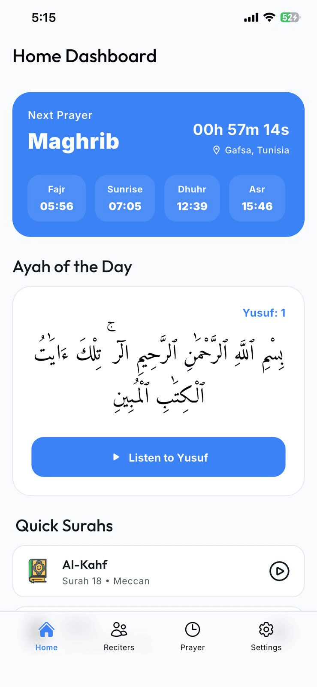
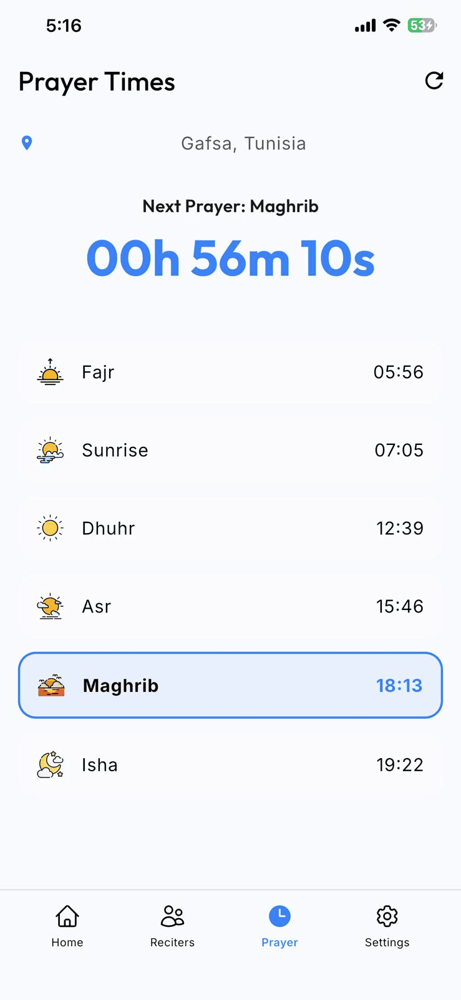
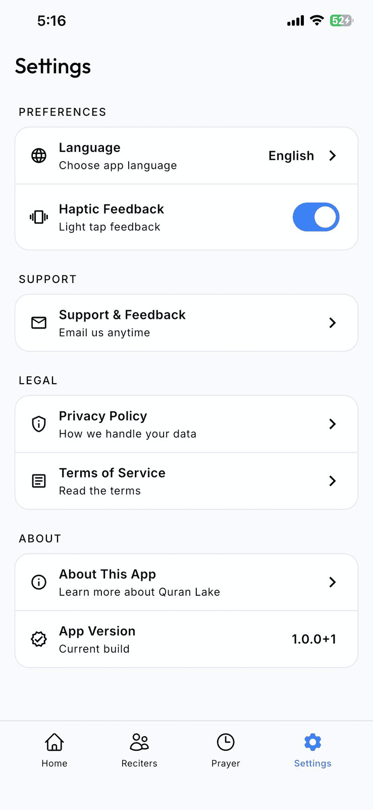

<div align="center">
  
  <h1>Quran Lake</h1>
  <p>An open-source Quran and prayer times app built with Flutter by Youssef Dhibi.</p>
</div>

## What is this?

Quran Lake is a mobile app I built using Flutter to help Muslims around the world. It gives you access to full Quran recitations, accurate prayer times based on where you are, and it saves things locally so you can use it offline too. 

I decided to make this completely open source. You can use the code, change it, share it, or do basically whatever you want with it under the MIT License. I would love to see what you build.

## Features

* **Listen to the Quran**: Audio playback works in the background and foreground using just_audio and audio_service.
* **Prayer Times**: It figures out your exact daily prayer times based on your device coordinates using geolocator.
* **Works Offline**: I set up local caching with sqflite and shared_preferences so you do not always need internet.
* **Languages**: It supports both Arabic and English right out of the box.
* **Splash Screens**: Native splash screens are configured for Android and iOS using flutter_native_splash.
* **State Management**: The app uses Provider to keep the code and state organized.

## Screenshots

<div align="center">
  
  
  
  
</div>

## Tech Stack

I tried to keep the architecture clean and separate the UI, business logic, and data.

* **Flutter**: ^3.11.0
* **State**: Provider
* **Network**: Dio
* **Storage**: Sqflite
* **Location**: Geolocator
* **Audio**: Just Audio

## Running the app

If you want to run this locally, make sure you have the Flutter SDK (^3.11.0) installed and an emulator or physical device hooked up.

1. Clone this repo:
   ```bash
   git clone https://github.com/youssefsz/Quran-Lake-Mobile-App-Flutter.git
   cd Quran-Lake-Mobile-App-Flutter
   ```
2. Get the packages:
   ```bash
   flutter pub get
   ```
3. Run it:
   ```bash
   flutter run
   ```

## Contributing

Like I said, this is open source, so feel free to contribute. If you want to fix a bug or add a feature, just fork the repo, create a branch with your changes, and open a Pull Request.

## License

This project is open source under the MIT License. See the [LICENSE](LICENSE) file for the legal details, but basically, do what you want with the code.
